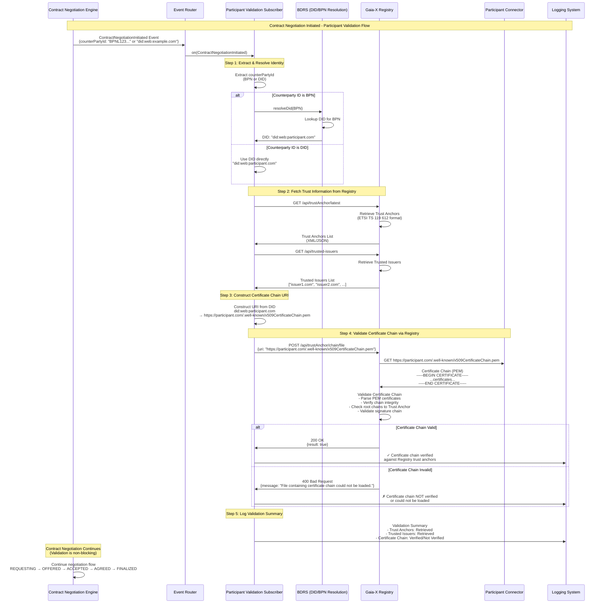
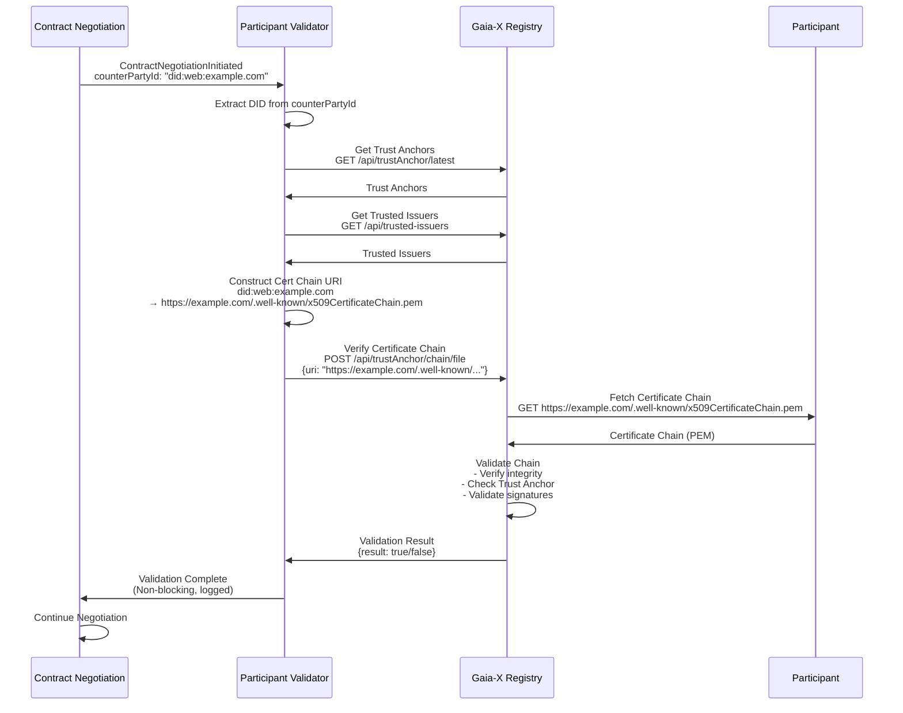
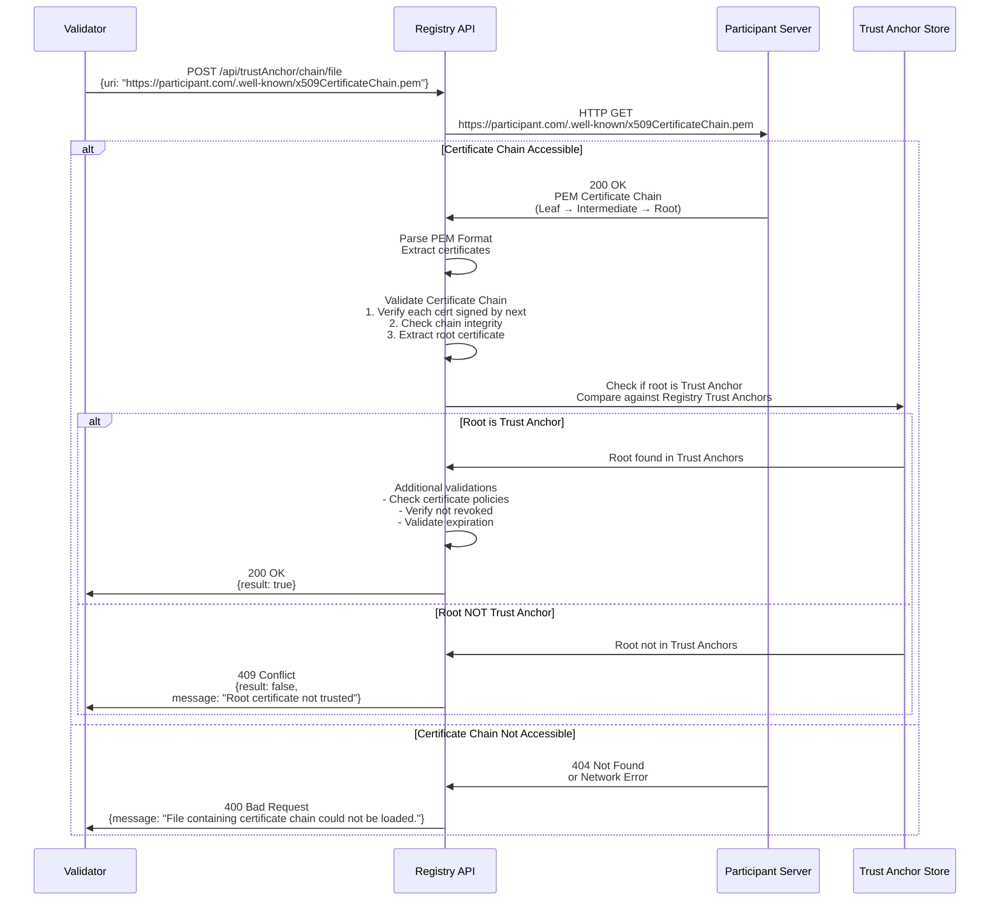
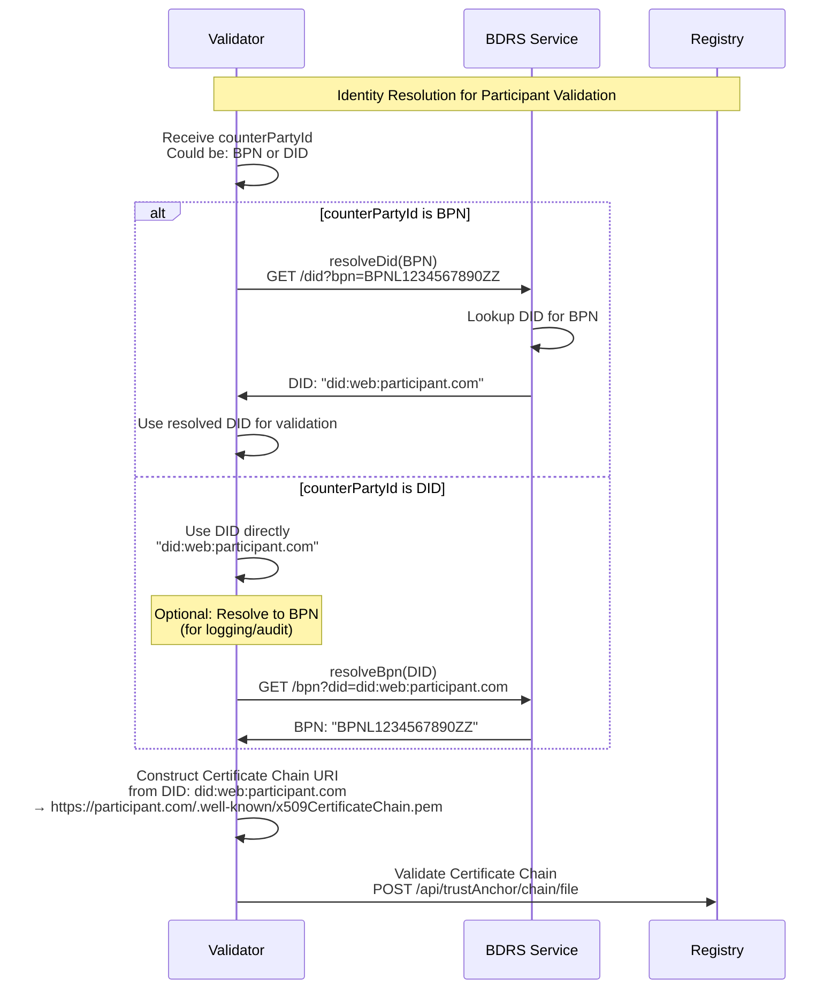

# Participant Validation Sequence Diagram

## Gaia-X Registry Integration Flow

```mermaid
sequenceDiagram
    participant CN as Contract Negotiation Engine
    participant ER as Event Router
    participant PVS as Participant Validation Subscriber
    participant BDRS as BDRS (DID/BPN Resolution)
    participant REG as Gaia-X Registry
    participant PART as Participant Connector
    participant LOG as Logging System

    Note over CN,LOG: Contract Negotiation Initiated - Participant Validation Flow

    CN->>ER: ContractNegotiationInitiated Event<br/>{counterPartyId: "BPNL123..." or "did:web:example.com"}
    ER->>PVS: on(ContractNegotiationInitiated)
    
    Note over PVS: Step 1: Extract & Resolve Identity
    PVS->>PVS: Extract counterPartyId<br/>(BPN or DID)
    
    alt Counterparty ID is BPN
        PVS->>BDRS: resolveDid(BPN)
        BDRS->>BDRS: Lookup DID for BPN
        BDRS->>PVS: DID: "did:web:participant.com"
    else Counterparty ID is DID
        PVS->>PVS: Use DID directly<br/>"did:web:participant.com"
    end

    Note over PVS,REG: Step 2: Fetch Trust Information from Registry
    PVS->>REG: GET /api/trustAnchor/latest
    REG->>REG: Retrieve Trust Anchors<br/>(ETSI TS 119 612 format)
    REG->>PVS: Trust Anchors List<br/>(XML/JSON)
    
    PVS->>REG: GET /api/trusted-issuers
    REG->>REG: Retrieve Trusted Issuers
    REG->>PVS: Trusted Issuers List<br/>["issuer1.com", "issuer2.com", ...]

    Note over PVS: Step 3: Construct Certificate Chain URI
    PVS->>PVS: Construct URI from DID<br/>did:web:participant.com<br/>→ https://participant.com/.well-known/x509CertificateChain.pem

    Note over PVS,PART: Step 4: Validate Certificate Chain via Registry
    PVS->>REG: POST /api/trustAnchor/chain/file<br/>{uri: "https://participant.com/.well-known/x509CertificateChain.pem"}
    
    REG->>PART: GET https://participant.com/.well-known/x509CertificateChain.pem
    PART->>REG: Certificate Chain (PEM)<br/>-----BEGIN CERTIFICATE-----<br/>...certificates...<br/>-----END CERTIFICATE-----
    
    REG->>REG: Validate Certificate Chain<br/>- Parse PEM certificates<br/>- Verify chain integrity<br/>- Check root chains to Trust Anchor<br/>- Validate signature chain
    
    alt Certificate Chain Valid
        REG->>PVS: 200 OK<br/>{result: true}
        PVS->>LOG: ✓ Certificate chain verified<br/>against Registry trust anchors
    else Certificate Chain Invalid
        REG->>PVS: 400 Bad Request<br/>{message: "File containing certificate chain could not be loaded."}
        PVS->>LOG: ✗ Certificate chain NOT verified<br/>or could not be loaded
    end

    Note over PVS: Step 5: Log Validation Summary
    PVS->>LOG: Validation Summary<br/>- Trust Anchors: Retrieved<br/>- Trusted Issuers: Retrieved<br/>- Certificate Chain: Verified/Not Verified
    
    Note over CN: Contract Negotiation Continues<br/>(Validation is non-blocking)
    CN->>CN: Continue negotiation flow<br/>REQUESTING → OFFERED → ACCEPTED → AGREED → FINALIZED
```

## Simplified Flow Diagram

```mermaid
sequenceDiagram
    participant CN as Contract Negotiation
    participant VAL as Participant Validator
    participant REG as Gaia-X Registry
    participant PART as Participant

    CN->>VAL: ContractNegotiationInitiated<br/>counterPartyId: "did:web:example.com"
    
    VAL->>VAL: Extract DID from counterPartyId
    
    VAL->>REG: Get Trust Anchors<br/>GET /api/trustAnchor/latest
    REG->>VAL: Trust Anchors
    
    VAL->>REG: Get Trusted Issuers<br/>GET /api/trusted-issuers
    REG->>VAL: Trusted Issuers
    
    VAL->>VAL: Construct Cert Chain URI<br/>did:web:example.com<br/>→ https://example.com/.well-known/x509CertificateChain.pem
    
    VAL->>REG: Verify Certificate Chain<br/>POST /api/trustAnchor/chain/file<br/>{uri: "https://example.com/.well-known/..."}
    
    REG->>PART: Fetch Certificate Chain<br/>GET https://example.com/.well-known/x509CertificateChain.pem
    PART->>REG: Certificate Chain (PEM)
    
    REG->>REG: Validate Chain<br/>- Verify integrity<br/>- Check Trust Anchor<br/>- Validate signatures
    
    REG->>VAL: Validation Result<br/>{result: true/false}
    
    VAL->>CN: Validation Complete<br/>(Non-blocking, logged)
    
    CN->>CN: Continue Negotiation
```

## Certificate Chain Validation Detail

```mermaid
sequenceDiagram
    participant VAL as Validator
    participant REG as Registry API
    participant PART as Participant Server
    participant TA as Trust Anchor Store

    VAL->>REG: POST /api/trustAnchor/chain/file<br/>{uri: "https://participant.com/.well-known/x509CertificateChain.pem"}
    
    REG->>PART: HTTP GET<br/>https://participant.com/.well-known/x509CertificateChain.pem
    
    alt Certificate Chain Accessible
        PART->>REG: 200 OK<br/>PEM Certificate Chain<br/>(Leaf → Intermediate → Root)
        
        REG->>REG: Parse PEM Format<br/>Extract certificates
        
        REG->>REG: Validate Certificate Chain<br/>1. Verify each cert signed by next<br/>2. Check chain integrity<br/>3. Extract root certificate
        
        REG->>TA: Check if root is Trust Anchor<br/>Compare against Registry Trust Anchors
        
        alt Root is Trust Anchor
            TA->>REG: Root found in Trust Anchors
            REG->>REG: Additional validations<br/>- Check certificate policies<br/>- Verify not revoked<br/>- Validate expiration
            REG->>VAL: 200 OK<br/>{result: true}
        else Root NOT Trust Anchor
            TA->>REG: Root not in Trust Anchors
            REG->>VAL: 409 Conflict<br/>{result: false,<br/>message: "Root certificate not trusted"}
        end
    else Certificate Chain Not Accessible
        PART->>REG: 404 Not Found<br/>or Network Error
        REG->>VAL: 400 Bad Request<br/>{message: "File containing certificate chain could not be loaded."}
    end
```

## DID/BPN Resolution Flow

```mermaid
sequenceDiagram
    participant VAL as Validator
    participant BDRS as BDRS Service
    participant REG as Registry

    Note over VAL,REG: Identity Resolution for Participant Validation

    VAL->>VAL: Receive counterPartyId<br/>Could be: BPN or DID

    alt counterPartyId is BPN
        VAL->>BDRS: resolveDid(BPN)<br/>GET /did?bpn=BPNL1234567890ZZ
        BDRS->>BDRS: Lookup DID for BPN
        BDRS->>VAL: DID: "did:web:participant.com"
        VAL->>VAL: Use resolved DID for validation
    else counterPartyId is DID
        VAL->>VAL: Use DID directly<br/>"did:web:participant.com"
        Note over VAL: Optional: Resolve to BPN<br/>(for logging/audit)
        VAL->>BDRS: resolveBpn(DID)<br/>GET /bpn?did=did:web:participant.com
        BDRS->>VAL: BPN: "BPNL1234567890ZZ"
    end

    VAL->>VAL: Construct Certificate Chain URI<br/>from DID: did:web:participant.com<br/>→ https://participant.com/.well-known/x509CertificateChain.pem

    VAL->>REG: Validate Certificate Chain<br/>POST /api/trustAnchor/chain/file
```

